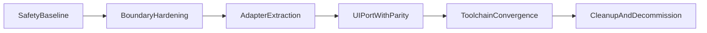

# All Ten Phase-by-Phase Migration Map

This map defines an incremental path to fully integrate All Ten while preserving existing player history.

## Phase 0: Safety Baseline (Current Start)

Deliverables:

- `docs/allten-migration/storage-compatibility-contract.md`
- `docs/allten-migration/regression-checklist.md`
- `docs/allten-migration/safe-shared-boundary.md`

Pass gate:

- Storage contract approved.
- Regression checklist runs clean.

Fail conditions:

- Missing/ambiguous storage key definition.
- Any untested path that can mutate `allten-profile`.

## Phase 1: Boundary Hardening

Tasks:

- Remove/avoid direct cross-runtime React component imports between `src/allten/runtime` and `src/shared` (enforced by `npm run check:allten-boundary`).
- All Ten is served from the **Vite** multi-page entry [`puzzlegames/allten/index.html`](../../puzzlegames/allten/index.html) with [`src/allten/main.jsx`](../../src/allten/main.jsx); game sources compile from [`src/allten/runtime/src`](../../src/allten/runtime/src) via direct imports.
- A legacy **Webpack** build still exists under `src/allten/runtime` (`npm --prefix src/allten/runtime run build`) only for embeds or historical workflows; the **suite** does not copy `bundle_allten.js` into `puzzlegames/allten` anymore.

Pass gate:

- All Ten loads without React child/type runtime errors.
- Other games keep shared top bar behavior.

## Phase 2: Adapter Extraction (Logic-First)

Tasks:

- Extract shared-neutral interfaces for:
  - Header action contract (home, links, stats, help)
  - Modal content contract
  - Date/storage helper constants
- Keep All Ten and suite rendering separate; integrate only via data/function adapters.

Pass gate:

- No React components imported across boundary.
- All storage and UI regression checks pass.

## Phase 3: UI Port With Parity Gates

Tasks:

- Port one All Ten surface at a time into suite-native runtime:
  1. Header behavior
  2. Help modal shell
  3. Links modal shell
  4. Stats surface
- After each surface, run full regression checklist before proceeding.

Pass gate per surface:

- Visual/behavior parity confirmed.
- Storage counters unchanged except expected gameplay increments.

Fail condition:

- Any mismatch in daily play counters/streak updates or modal behavior.

## Phase 4: Toolchain Convergence

Tasks:

- All Ten game UI and `AppState` ship through the **same Vite build** as other games (MPA entry + shared React 19).
- Runtime code is now colocated under [`src/allten/runtime/src`](../../src/allten/runtime/src) while the suite keeps a single Vite pipeline.
- Legacy Webpack UMD output is **not** part of the root `npm run build` / `deploy` path; root scripts no longer copy `bundle_allten.js` into `puzzlegames` or `dist`.

Pass gate:

- One build pipeline for all games (`npm run build`).
- No runtime dependency on a pre-copied `bundle_allten.js` for the suite All Ten page.
- Stats migration entry/toolchain criteria satisfied (see `docs/allten-migration/stats-and-toolchain-criteria.md`).

## Phase 5: Cleanup and Decommission

Tasks:

- Remove temporary adapters and duplicate assets.
- Archive migration docs with final notes.
- Add permanent CI checks for storage regression cases.

Final signoff gate:

- 2+ consecutive release-candidate runs pass full checklist.
- Manual validation confirms existing streak/history continuity on real profile data.
